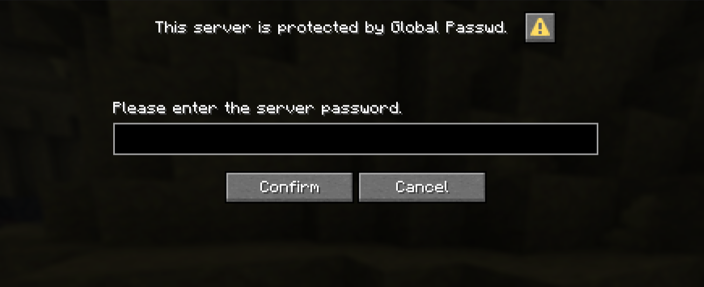

Global Passwd is a Minecraft plugin that, once installed on your server, lets you set a global password that locks the server. 
When the server is locked, every player trying to connect will be prompted to enter the password. 
If the password is correct, they will successfully be connected; otherwise they will be disconnected.

This screen will appear when you try to join the server :

### Security

The password is stored on the server hardware and never leaves it. 
It is stored using SHA256 hashing, meaning the password can't be read at all after being saved. 
This also means you won't be able to recover your server password if you forget it.

The version of the plugin shipped by me uses a randomized salt that is not committed to GitHub.
See the "Documentation" section in this file to see how to compile your own version of the plugin with a custom salt to enhance your server security.

### Sessions

To enhance the user experience, this plugin is shipped with a system called "sessions".
When a player trying to connect types in the right password, their UUID will be saved in a local database stored directly on your server.

Sessions don't last for a lifetime. By default, a session lasts **30 days**. You can change this value; see the 'Configuration' part of the documentation below.

This system can be disabled. See the "Configuration" part of the documentation below.

### Customization

Any server owner can customize the plugin to their liking by directly typing into the chat the "passwd" command, or by editing the `config.yml` file on your server.
For further information, please refer to the documentation below.

 

# Documentation

 

## How to use

To start using Global Passwd on your server, you will first need to download the JAR file of the plugin and place it into your `plugins` folder of your Minecraft server.
You can download the plugin on Modrinth, Curseforge, or GitHub (links to be added).

### Advanced

You can also clone this repo and compile the plugin yourself, using a custom salt to enhance your server security.
See the 'Enhance the server security' part of this documentation for further information.

 

## Configuration

You can configure the server by using the 'passwd' command for basic usage, and you can edit the `config.yml` file to configure the plugin even more.

### '/passwd' command

You can start to type in your in-game chat '/passwd' to see the available sub-commands. 
Every sub-command has a specific permission required to be run. 
If you are a server operator, these are bypassed.

 

#### '/passwd status'

Shows the current status of the plugin: if the password is enabled, if the sessions are enabled, and the number of sessions stored on the server.

> Permission associated: 'globalpasswd.passwd.status'.

 

#### '/passwd enable'

Enables the password server-wide. 
If the password is already enabled, the plugin will warn you about that and won't change anything.

> Permission associated: 'globalpasswd.passwd.enable'.

 

#### '/passwd disable'

Disables the password server-wide. 
If the password is already disabled, the plugin will warn you about that and won't change anything.

> Permission associated: 'globalpasswd.passwd.disable'.

 

#### '/passwd change \<password>'

Changes the password to the given \<password>.
The effect of this command is immediate.

> Permission associated: 'globalpasswd.passwd.change'.

 

#### '/passwd sessions enable'

Enables the session system.
If the session system is already enabled, the plugin will warn you about that and won't change anything.

> Permission associated: 'globalpasswd.passwd.sessions.enable'.

 

#### '/passwd sessions disable'

Disables the session system.
If the session system is already disabled, the plugin will warn you about that and won't change anything.

> Permission associated: 'globalpasswd.passwd.sessions.disable'.

 

#### '/passwd sessions add \<player>'

Adds a session for the given \<player>.
The session will last the same amount of time as any other session (see the `config.yml` file).
Once this session is expired, the player will need to enter the server password upon their next connection to refresh their session.

In other words, the player won't have to enter the password upon their next connection, even if they have never been connected to the server.

The player specified can be online or offline, and even if the player has not joined the server a single time, the command will perform as intended.

> Permission associated: 'globalpasswd.passwd.sessions.add.player'.

 

#### '/passwd sessions delete'

Deletes the session for the player sending this command.

In other words, the player sending this command will have to enter the server password upon their next connection, even if they had a previous valid session beforehand, in order to create a new session and connect to the server.

> Permission associated: 'globalpasswd.passwd.sessions.delete.player'.

 

#### '/passwd sessions delete \<player>'

Deletes the session for the given \<player> if it exists.
If it does not, nothing will happen and the plugin will warn you about this fact.

In other words, the player will have to enter the server password upon their next connection, even if they had a previous valid session beforehand, in order to create a new session and connect to the server.

The player specified can be online or offline, and even if the player has not joined the server a single time, the command will perform as intended.

> No permission is associated with this command.

 

#### '/passwd sessions delete all'

Deletes **all** sessions. Use this command at your own risk.

In other words, every player who had a session beforehand will need to enter the server password upon their next connection in order to create a new session and connect to the server. 

This command can be used to clear the local database from time to time, as invalid player sessions are not deleted automatically.

> Permission associated: 'globalpasswd.passwd.sessions.remove.delete.all'.

 

### Config file

The `config.yml` file is located in your Minecraft server directory, under the `./plugins/GlobalPasswd/` directory.
Use the text editor of your choice to edit it.

Here is a list of all the settings you can change.

 

#### `enabled` (line 3)

Specify whether the server password is enabled or not. If it is not, no prompt will be given to players trying to connect, and your server will not be protected.

> Possible values: `true` (the password is enabled), `false` (the password is disabled).

> Default value: `true`

 

#### `timeout-duration` (line 6)

The amount of time given to a player to enter the server password, in seconds.

When this time has expired, the player will be disconnected without further notice.
This system prevents unwanted passive connections.

> Possible values: any positive integer.

> Default value: `120`

 

#### `sessions-enabled` (line 10)

Specify whether the sessions system is enabled or not. 
If not, every player will need to enter the server password upon every connection, even if they had it right during the last connection.

If you disable the sessions system, every session that already exists will continue to be saved. 
This means that, if you decide to enable this system once again, every session will still be valid as if nothing happened.

> Possible values: `true` (sessions are enabled), `false` (sessions are disabled).

> Default value: `true`

 

#### `sessions-duration` (line 13 through line 16)

The time a session will remain valid. You have different values for `days`, `hours`, `minutes`, and `seconds`. They all add up during verification.

When a player enters the password correctly, the plugin will save their UUID alongside their connection date. 
When the same player then tries to connect to the server again, this amount of time will be added to the stored connection date. 
If the obtained date is earlier than the current date of your server, the player will have to enter the server password again.

> Possible values: any positive integer.

> Default value: 30 days, 0 hours, 0 minutes, 0 seconds

 

## Enhance your server protection

You can clone this repository, add a custom salt, and compile this plugin by yourself.
This will make the freshly compiled plugin use a different salt than every other version shipped by default, thus enhancing your server security.

This method is not the easiest method to run this plugin on your server, so proceed at your own risk.

You legally cannot do whatever you want with the newly compiled plugin. 
Every compilation of this plugin done by yourself is subject to the License this project is under. 
You can find this License in the `./LICENSE` file. But for general use, like a private server, you generally don't have to worry about that.

You have been warned. Let's get started!

### Prerequisites

The [git](https://git-scm.com/) software is installed on your device. 
A guide to install git can be found [here](https://git-scm.com/install/).

You also have a valid [Java JDK](https://en.wikipedia.org/wiki/Java_Development_Kit) installed. 
A guide to install a Java JDK can be found [here](https://adoptium.net/temurin/releases/?version=25). 
For this project, version 25 is mandatory. You can use any other distribution of the Java JDK.

### 1. Clone this repository

Hop into your terminal (or CMD/PowerShell for Windows users), and go to the directory you want to copy this repository into.
You can create a directory directly in your Desktop directory, or in any other directory. 

To go into this directory, you need to use the [`cd` command]().

Then enter the command `git clone https://github.com/brindyrwlt/Global-Passwd.git`. If there is no error, then the project has been cloned successfully.

### 2. Add a custom salt

To add your custom salt to the project, you will need to go into the `./src/main/resources/` directory.

You will then create a file named **exactly** '<u>**salt**</u>'. If this file is not named like that, the plugin won't compile.
To create such a file in Linux, you can use the `touch salt` command in the directory. In Windows, you can just right-click, create a text document, and name it 'salt' (**make sure to remove the '.txt'**).

In this file, you will put the salt. 
A text-based salt is a sequence of characters used to encrypt data. The more complex and the longer it is, the more secure it will be.

I recommend using [this website](https://www.uuidgenerator.net/version4) to generate a random UUID to use as a salt. 
You can also smash your keyboard for a minute if that's more your way of doing things (given that you have a spare keyboard).

### 3. Customize the plugin

If you know a bit about Java and Minecraft development, you can also modify this plugin to your liking.

I would like to remind you that any modification made to this plugin and the redistribution or usage of it are subject to the License distributed in this repository.

### 4. Compile the plugin

Go back to your terminal, and go back to the root of the project (`cd ../../../`).

Run this command: `./gradlew build`.
If your environment is well-configured, then the plugin will be compiled!

To find the compiled plugin, go into the `./build/libs/` directory, and find the .jar named after this plugin (likely global-passwd-[...].jar).

### 5. Use the compiled plugin

Take the compiled plugin and put it into the `./plugins` directory of your server.

Start the server, and everything should work just fine!

> Warning: if you already have the Global Passwd plugin installed and configured on your server, you first need to delete the already installed .jar file, then move the freshly-compiled plugin into your server.
> 
> In this case, your old password won't work anymore. 
> Please run the `/passwd change <password>` command to change the password. 
> Your new password will use the new salt.

 

# Report a bug

Feel free to [open an Issue](https://github.com/brindyrwlt/Global-Passwd/issues) on the GitHub page of this plugin if you encounter any bug or thing you would want to change in this plugin.

# Credits

This plugin was developed entirely by [me](https://github.com/brindyrwlt). No AI was used during the process.

The use of the Dialog API provided by Paper and the timeout system were inspired by the [Password](https://github.com/foenichs/Password/) plugin developed by [foenichs](https://github.com/foenichs). Please check his work, he make very cool stuff!
